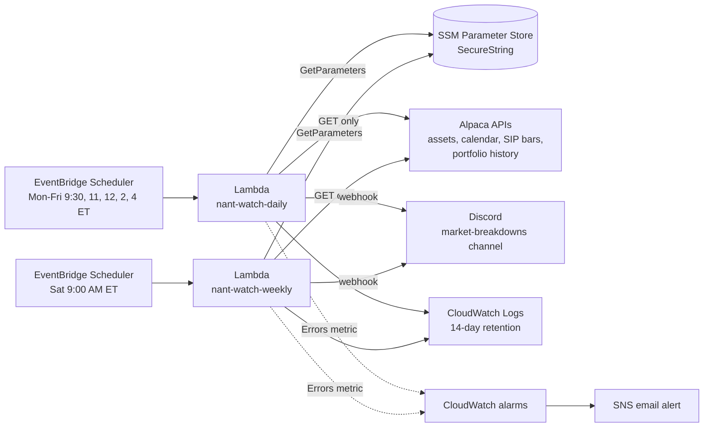

# NantWatch (Project 4)

Read-only, serverless market-intel bot for my Background Workforce. It posts to its own Discord channel:

- **Weekdays, 5 posts (ET):** 9:30 AM market-open review (last session's top movers + race) · 11 AM, 12 PM and 2 PM live race updates · 4:00 PM market-close review (today's movers + race)
- **Weekly breakdown** (Sat, 9:00 AM ET): top 10 weekly gainers/losers + race scoreboard (NantBot vs Sparticus vs SPY since Oct 5, 2026)

It **never places orders**: the Alpaca client can only send GET requests to an allowlist of read-only paths, and tests prove it.

Case study for interviews: [docs/case-study.md](docs/case-study.md)

## Architecture

| Piece | Choice | Why |
|---|---|---|
| Compute | 2 Lambdas, python3.12, arm64, 512 MB | Runs ~110 times a month; no servers to patch |
| Schedule | EventBridge Scheduler in America/New_York | Daylight saving handled by AWS |
| Secrets | SSM SecureString, fetched once per run | Free tier; each function can read only its own parameters |
| Data | Alpaca SIP daily bars, 200 symbols per request | ~12,300 symbols in ~62 requests, under the 200/min limit |
| Dependencies | Python standard library only | Tiny package, nothing to patch, no supply-chain risk |
| Failure handling | Discord alert + CloudWatch alarm -> email | You hear about a broken run the same day |

## Operate it

    # dry runs (build everything, post nothing)
    aws lambda invoke --function-name nant-watch-daily  --payload '{"dry_run": true}' --cli-binary-format raw-in-base64-out --cli-read-timeout 310 --region us-east-2 /tmp/nd.json
    aws lambda invoke --function-name nant-watch-weekly --payload '{"dry_run": true}' --cli-binary-format raw-in-base64-out --cli-read-timeout 610 --region us-east-2 /tmp/nw.json

    # logs
    aws logs tail /aws/lambda/nant-watch-daily --since 1h --region us-east-2

    # remove everything (NantBot and SSM parameters are untouched)
    sam delete --stack-name nant-watch --region us-east-2

## Run tests

    PYTHONPATH=src python3 -m unittest discover -s tests -v

## Deploy

    sam build && sam deploy

## Milestones

- [x] M1 Foundation: formatting + Discord poster + tests (v0.1.0)
- [x] M2 Market math (pure) (v0.2.0)
- [x] M3 Read-only Alpaca client (v0.3.0)
- [x] M4 Market scanner (local run) (v0.4.0)
- [x] M5 Daily breakdown on AWS (v0.5.0)
- [x] M6 Race scoreboard (v0.6.0)
- [x] M7 Weekly breakdown on AWS (v0.7.0)
- [x] M8 Hardening + portfolio write-up (v1.0.0)
- [x] v1.1 Weekday schedule: open review, live race updates, close review (v1.1.0)
